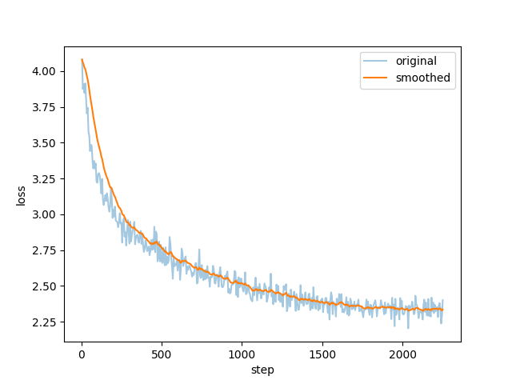

# Fine-tuning Korean-Chinese LLM

## Introduction
This repo is devoted to output a Large-scale Language Model (LLM), fine-tuned to prioritize literary qualities in translations between Korean and Chinese, emphasizing emotional depth and stylistic nuances over literal word-for-word translation. 
The goal is to produce translations that reflect the original's tone, style, and emotional depth, ensuring that literary and expressive aspects are conveyed effectively. And the model will focus on delivering translations that are not only accurate and rich in literary expression but also as natural as human translations.

## LLM model and fine-tuning framework
The LLM this repo used is [ChatGLM3-6b](https://github.com/THUDM/ChatGLM3), a medium size open source LLM model trained specifically with Chinese dataset. It contains 6 billion parameters, which means it can be fine-tuned with lora in a GPU with memory around 20 gigabytes.

The fine-tuning framework we adopted is [LLaMA-Factory](https://github.com/hiyouga/LLaMA-Factory), it is a web-ui wrapped fine-tuning framework that is quite friendly for beginners. It supports fine-tuning of many LLaMA based LLM and also ChatGLM. It contains a lot of fine-tuning dataset and also supports customized dataset with specific format.

## Korean-Chinese dataset

## Fine-tuning process and outcome
The setting for fine-tuning is listed as below:

| Parameter             | Value  |
| --------------------- | ------ |
| Cutoff length         | 1024   |
| Learning rate         | 5e-5   |
| Epochs                | 50     |
| Max samples           | 100000 |
| Compute type          | fp16   |
| Batch size            | 4      |
| Gradient accumulation | 4      |
| LR scheduler          | cosine |
| Maximum gradient norm | 1.0    |
The loss during the training is listed as below

## Checkpoints and how to use them
The checkpoints are stored in `checkpoints` directory, clone the LLaMA-Factory repo and copy all files into the `saves/` directory of it, then you can find checkpoints in the web-ui. It can be further fine-tuned or deployed for chat. 

## Todo
 - [ ] Collect more data to fine-tune
 - [ ] Change for larger language models or fine-tune with full parameter (when I get more GPUs)
 - [ ] Find out a more efficient way to prompt LLMs to do specific machine translation tasks

